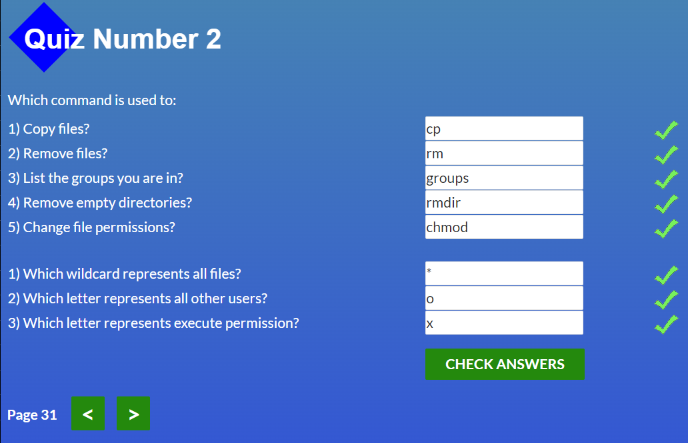
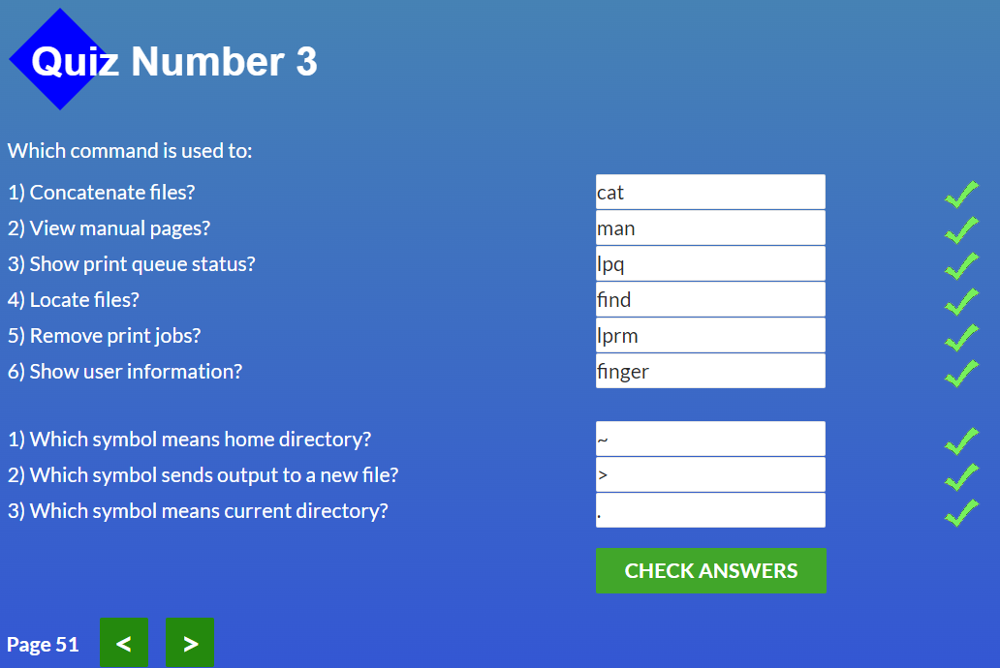
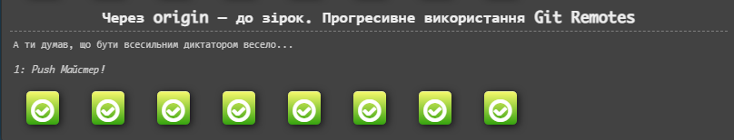
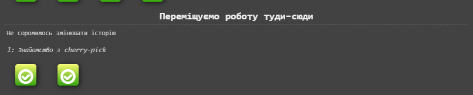
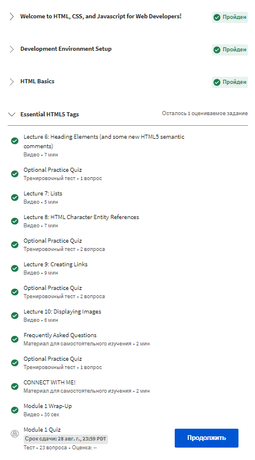
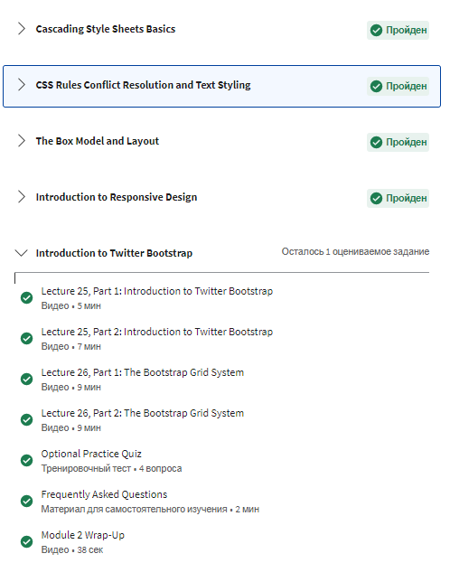
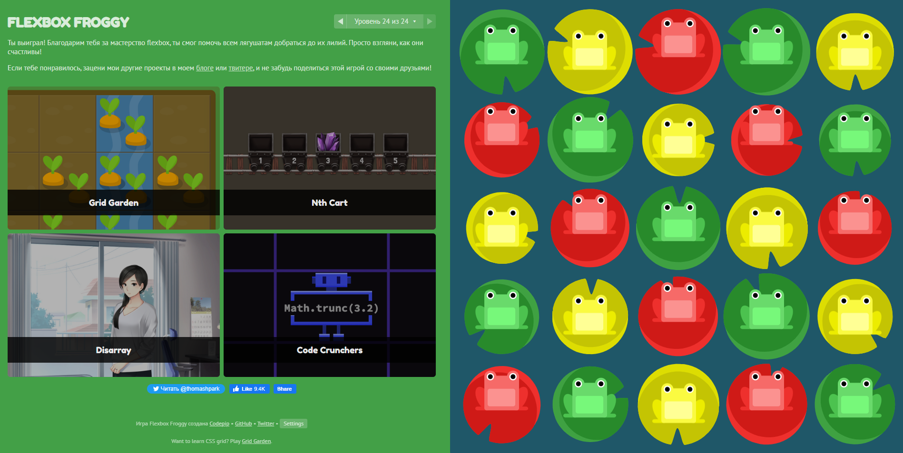
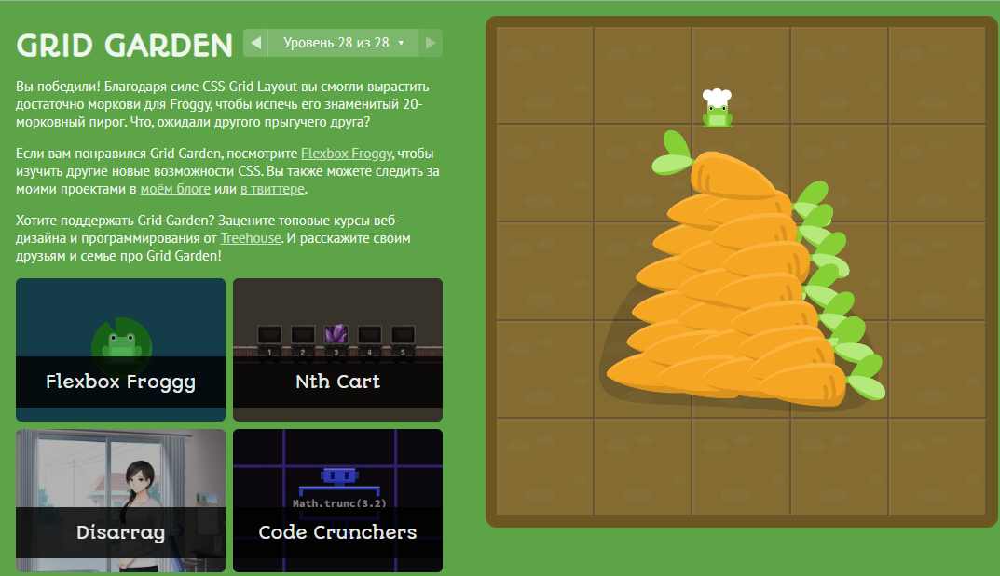
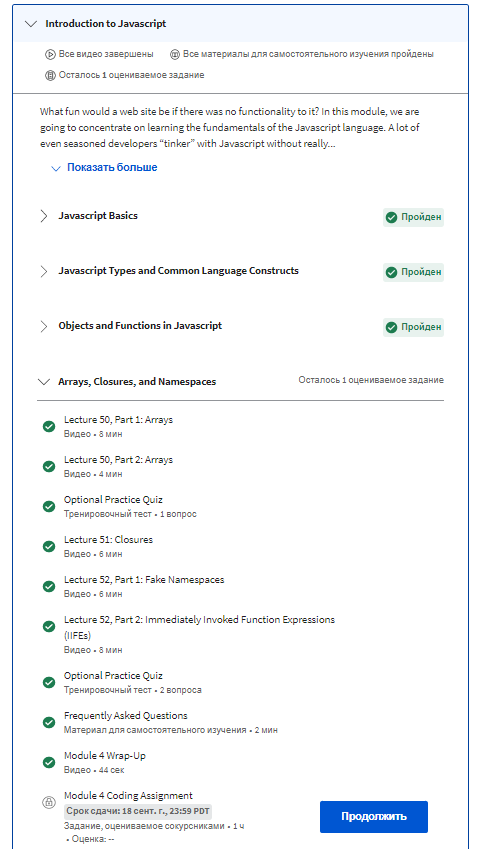
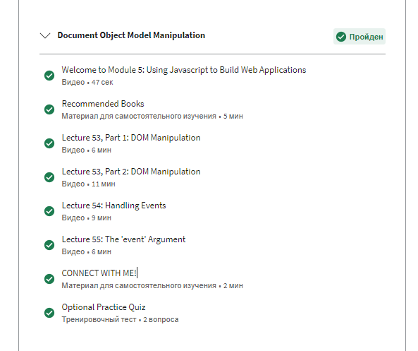

# Stage 0. Self-Study
## General
 - [x] Git Basics
  - 

        
coursera.org

        
        

  - 

        
learngitbranching

                
        

  - 

        
pull-request

        

  ##### ЗВІТНІСТЬ:
  >Раніше я гіт використовував дуже просто. Для запису однієї гілки, лише для себе та для сбереження старого коду для його відновлення. Система контролю версій дуже корисна річ. Під час перегляду курсів і практичних завдань, зрозумів, що його функціонал багатий. Робота з гілками складна, але цікава. гарна практика. Закортіло поринути у гіт з головою)
      
  

Додаткові матеріали(для себе):

 
###### [Лекція по Git від Олексія Руденка](https://www.youtube.com/playlist?list=PLS8sEUxbfFY9MnPIFPTNlaS5xX7P5Ge-5)
###### [Git за 30 хвилин](https://codeguida.com/post/453)
###### [Git tips](http://sixrevisions.com/web-development/git-tips/) — закріпити свої знання про Git
###### [About Merge Conflicts](https://docs.github.com/en/free-pro-team@latest/github/collaborating-with-issues-and-pull-requests/about-merge-conflicts)
###### [Resoilving a Merge Conflict](https://docs.github.com/en/free-pro-team@latest/github/collaborating-with-issues-and-pull-requests/resolving-a-merge-conflict-using-the-command-line)
###### [Communicating using Markdown](https://lab.github.com/githubtraining/communicating-using-markdown)
###### [Learn anything front-end](https://learn-anything.xyz/web-development/front-end)
###### [How to Learn and Cope with Negative Thoughts](https://guides.hexlet.io/learning/)
 
  

  
#
   
 - [x] Linux CLI and Networking
  - 

        
linuxsurvival.com

        
        
        
        
        

  
    ##### ЗВІТНІСТЬ:
  >Деякі команди знав, але далеко не всі. Дуже цікаво було ознайомитись деякими з них та використовувати в подальшому.
  
#

 - [x] VCS (hello gitty), GitHub and Collaboration
  - 

        
Git Collaboration

        
        
        

        
    ##### ЗВІТНІСТЬ:
  >Робив ці завдання ще спочатку, освіжив свої знання повернувшись до цих завдань. Думаю не раз буду повертатися, так як знання і вміння працювати в git дуже потрібні будут подальшому в роботі
  
#
## Front-End Basics
 - [x] Intro to HTML & CSS
  - 

        
codecademy.com

        
        
        

        
    ##### ЗВІТНІСТЬ:
  >цікаво було почути історію HTML. Чув про компанію W3C, але про компанію WHATWG нічого не було мені відомо. Дізнався, що самозакриваючий тег відноситься до XML типу. Щодо css, то згадав та оновив знання по box-sizing та по позиціонуванню.
- [x] Responsive Web Design
 - 

        
Скріни з ігор

        
        
        

    ##### ЗВІТНІСТЬ:
  >Раніше вже проходив гри flexbox froggy. Як і тоді зупинився на останньому рівні. Гарна гра, часто використовую флекси в практиці. Щодо грідів, то ніяк не міг до них дійти. Ось зараз настав цей час. Частково розібрался з ними. Розумію, що треба ще практика по грідам.

- [ ] [HTML & CSS Practice](https://github.com/kottans/frontend/blob/2022_UA/tasks/html-css-popup.md)
  [Demo](https://okylistik.github.io/kottans-frontend) | [Code base](https://github.com/Okylistik/kottans-frontend/tree/popup) | [PR](https://github.com/kottans/frontend-2022-homeworks/pull/497)

    ##### ЗВІТНІСТЬ:
  >
- [ ] [JavaScript Basics](https://github.com/kottans/frontend/blob/2022_UA/tasks/js-basics.md)
 - 

        
Скріни

        
        

    ##### ЗВІТНІСТЬ:
  >
- [ ] [Document Object Model - practice](https://github.com/kottans/frontend/blob/2022_UA/tasks/js-dom.md)
 - 

        
Скріни

        
        

    ##### ЗВІТНІСТЬ:
  >

## Advanced Topics
- [ ] [Building a Tiny JS World (pre-OOP) - practice](https://github.com/kottans/frontend/blob/2022_UA/tasks/js-pre-oop.md)
- [ ] [Object oriented JS - practice](https://github.com/kottans/frontend/blob/2022_UA/tasks/js-oop.md)
- [ ] [OOP exercise - practice](https://github.com/kottans/frontend/blob/2022_UA/tasks/js-post-oop.md)
- [ ] [Offline Web Applications - optional](https://github.com/kottans/frontend/blob/2022_UA/tasks/app-design-offline.md)
- [ ] [Memory pair game — real project!](https://github.com/kottans/frontend/blob/2022_UA/tasks/memory-pair-game.md)
- [ ] [Website Performance Optimization - optional](https://github.com/kottans/frontend/blob/2022_UA/tasks/app-design-performance.md)
- [ ] [Friends App - real project!](https://github.com/kottans/frontend/blob/2022_UA/tasks/friends-app.md)
