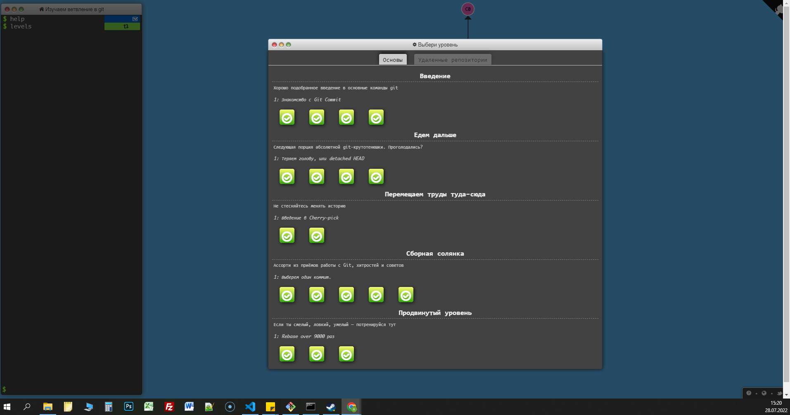
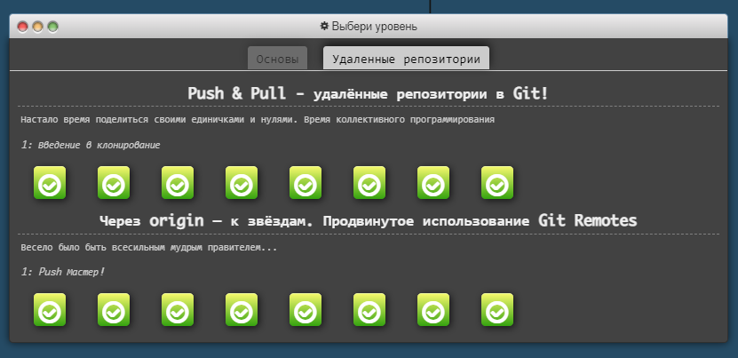

## Stage 0. Self-Study
### General
 - [x] Git Basics
  - 

        
coursera.org

        
        

  - 

        
learngitbranching

                
        

  - 

        
pull-request

        

      ##### ЗВІТНІСТЬ
      >Раніше я гіт використовував дуже просто. Для запису однієї гілки, лише для себе та для сбереження старого коду для його відновлення. Система контролю версій дуже корисна річ. Під час перегляду курсів і практичних завдань, зрозумів, що його функціонал багатий. Робота з гілками складна, але цікава. гарна практика. Закортіло поринути у гіт з головою)
- [ ] Linux CLI and Networking
- [ ] VCS (hello gitty), GitHub and Collaboration
### Front-End Basics
- [ ] Intro to HTML & CSS
- [ ] Responsive Web Design
- [ ] HTML & CSS Practice
- [ ] JavaScript Basics
- [ ] Document Object Model - practice
### Advanced Topics
- [ ] Building a Tiny JS World (pre-OOP) - practice
- [ ] Object oriented JS - practice
- [ ] OOP exercise - practice
- [ ] Offline Web Applications - optional
- [ ] Memory pair game — real project!
- [ ] Website Performance Optimization - optional
- [ ] Friends App - real project!
