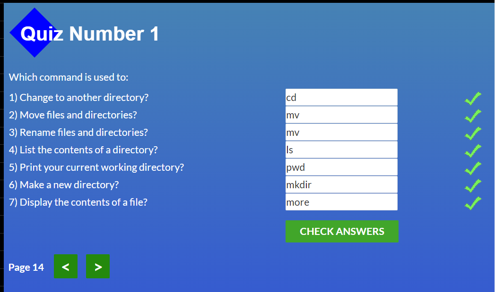
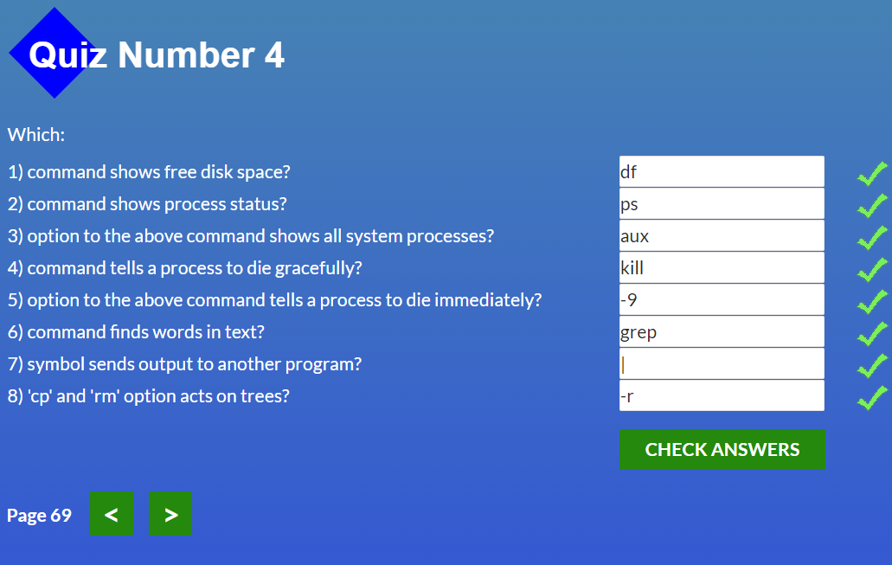

# Stage 0. Self-Study
## General
 - [x] Git Basics
  - 

        
coursera.org

        
        

  - 

        
learngitbranching

                
        

  - 

        
pull-request

        

  ##### ЗВІТНІСТЬ:
  >Раніше я гіт використовував дуже просто. Для запису однієї гілки, лише для себе та для сбереження старого коду для його відновлення. Система контролю версій дуже корисна річ. Під час перегляду курсів і практичних завдань, зрозумів, що його функціонал багатий. Робота з гілками складна, але цікава. гарна практика. Закортіло поринути у гіт з головою)
      
  

Додаткові матеріали:

 
###### [Лекція по Git від Олексія Руденка](https://www.youtube.com/playlist?list=PLS8sEUxbfFY9MnPIFPTNlaS5xX7P5Ge-5)
###### [Git за 30 хвилин](https://codeguida.com/post/453)
###### [Git tips](http://sixrevisions.com/web-development/git-tips/) — закріпити свої знання про Git
###### [About Merge Conflicts](https://docs.github.com/en/free-pro-team@latest/github/collaborating-with-issues-and-pull-requests/about-merge-conflicts)
###### [Resoilving a Merge Conflict](https://docs.github.com/en/free-pro-team@latest/github/collaborating-with-issues-and-pull-requests/resolving-a-merge-conflict-using-the-command-line)
###### [Communicating using Markdown](https://lab.github.com/githubtraining/communicating-using-markdown)
###### [Learn anything front-end](https://learn-anything.xyz/web-development/front-end)
###### [How to Learn and Cope with Negative Thoughts](https://guides.hexlet.io/learning/)
 
  

  
#
   
- [x] Linux CLI and Networking
  - 

        
linuxsurvival.com

        
        
        
        
        

  
    ##### ЗВІТНІСТЬ:
  >Деякі команди знав, але далеко не всі. Дуже цікаво було ознайомитись деякими з них та використовувати в подальшому.
  
#

- [ ] VCS (hello gitty), GitHub and Collaboration

#
## Front-End Basics
- [ ] Intro to HTML & CSS
- [ ] Responsive Web Design
- [ ] HTML & CSS Practice
- [ ] JavaScript Basics
- [ ] Document Object Model - practice
## Advanced Topics
- [ ] Building a Tiny JS World (pre-OOP) - practice
- [ ] Object oriented JS - practice
- [ ] OOP exercise - practice
- [ ] Offline Web Applications - optional
- [ ] Memory pair game — real project!
- [ ] Website Performance Optimization - optional
- [ ] Friends App - real project!
